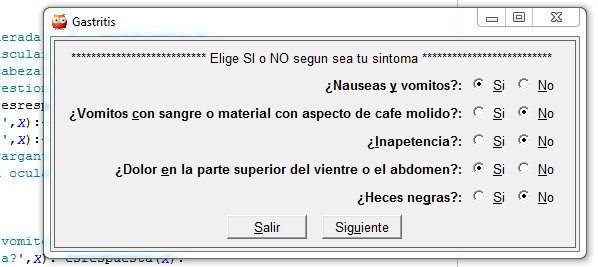

Sistema Experto Escrito en Prolog
==================================
Sistema experto creado como proyecto para la amteria de **Inteligencia artificial** 
Usa un interfaz escrita en Prolog [SWI](http://www.swi-prolog.org/packages/xpce/) 
Tiene la finalidad de diagnosticar enfermedades comunes como:
- migraña
- gastritis
- resfriado común

